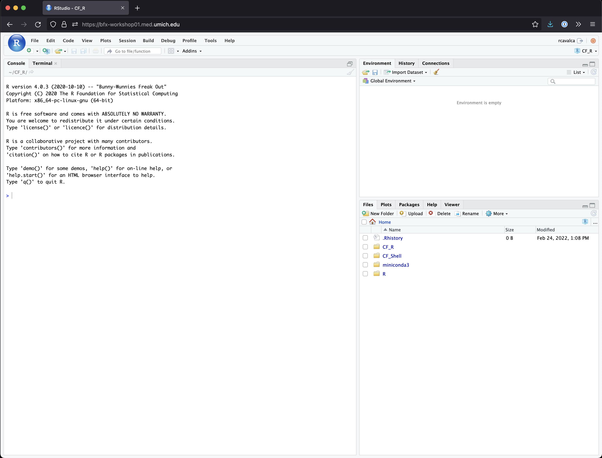

<style type="text/css">

body, td {
   font-size: 18px;
}
code.r{
  font-size: 12px;
}
pre {
  font-size: 12px
}

</style>

```{r, include = FALSE}
source("../bin/chunk-options.R")
knitr_fig_path("01-")
```

# Overview

In this lesson we will introduce you to RStudio, an Integrated Development Environment (IDE), that provides a simple and convenient graphical interface for using R. We have pre-configured this environment for you so that we can quickly jump into the nuts and bolts of R and RStudio rather than spending time on installing software. Though we are happy to offer guidance on setting up R and RStudio on your own computers after the workshop.

In this lesson we will introduce how to run commands, save code, and find help.

## Advantages of using R

At more than 20 years old, R is fairly mature and has a thriving community. Here are key advantages of analyzing data in R:

- **R is [open source](https://en.wikipedia.org/wiki/Open-source_software)**. This means R is free - an advantage if you are at an institution where you have to pay for your own MATLAB or SAS license. Open source, is important to your colleagues in parts of the world where expensive software in inaccessible. It also means that R is actively developed by a community (see [r-project.org](https://www.r-project.org/)), and there are regular updates.
- **R is widely used**. Because, R is used in many areas (not just bioinformatics), you are more likely to find help online when you need it. Chances are, almost any error message you run into, someone else has already experienced.
- **R is powerful**. R runs on multiple platforms (Windows/MacOS/Linux). It can work with much larger datasets than popular spreadsheet programs like Microsoft Excel, and because of its scripting capabilities is far more reproducible. Also, there are thousands of available software packages for science, including genomics and other areas of life science.

## Introducing RStudio Server

In these lessons, we will be making use of [RStudio](https://www.rstudio.com/products/RStudio/), an [Integrated Development Environment (IDE)](https://en.wikipedia.org/wiki/Integrated_development_environment). RStudio, like most IDEs, provides a graphical interface to R, making it user-friendly, and providing dozens of useful features. In this case, we are specifically using [RStudio Server](https://www.rstudio.com/products/RStudio/#Server), a version of RStudio that can be accessed in your web browser. RStudio Server has the same features of the Desktop version of RStudio you could download as standalone software.

## Log on to RStudio Server

Open a web browser and enter the following URL.

```
http://bfx-workshop01.med.umich.edu
```

You should now be looking at a page that will allow you to login to the RStudio server:


Enter your user credentials and click <kbd>Sign In</kbd>. The credentials were provided via email, but if you forget yours, a helper can retrieve it for you, just ask in Slack. You should now see the RStudio interface:




## Create an RStudio project

One of the first benefits we will take advantage of in RStudio is something called an **RStudio Project**. An RStudio project allows you to more easily:

- Save data, files, variables, packages, etc. related to a specific analysis project
- Restart work where you left off
- Collaborate, especially if you are using version control such as [git](http://swcarpentry.github.io/git-novice/).


1. To create a project, go to the <kbd>File</kbd> menu, and click <kbd>New Project...</kbd>. The following window will appear:


2. In this window, select <kbd>Existing Directory</kbd>. For "Project working directory", click <kbd>Browse...</kbd>, select the "CF_R" folder, and click <kbd>Choose</kbd>. This will use the `/home/workshop/user/CF_R` folder as the project directory.

3. Finally click <kbd>Create Project</kbd>. In the "Files" tab of your output pane (more about the RStudio layout in a moment), you should see an RStudio project file, **CF_R.Rproj**. All RStudio projects end with the "**.Rproj**" file extension.

Note that there is already a `data/` folder which contains the data we will use for these lessons.

## Creating your first R script

Now that we are ready to start exploring R, we will want to keep a record of the commands we are using. To do this we can create an R script:

- Click the <kbd>File</kbd> menu and select <kbd>New File</kbd> and then <kbd>R Script</kbd>.
- Before we go any further, save your script by clicking the save/disk icon that is in the bar above the first line in the script editor, or click the <kbd>File</kbd> menu and select <kbd>Save</kbd>.
- In the "Save File" window that opens, select <kbd>New Folder</kbd>. Name it **"scripts"**.
- Finally, name your file **"r_basics"** in the "File name" field.

The new script **r_basics.R** is now in the `scripts` folder. You can see that by clicking the `scripts` folder in the "Files" pane. And you can go back up to the main project folder by clicking the `..` to the right of the up arrow in the "Files" pane. By convention, R scripts end with the file extension **.R**.

## Overview of RStudio layout

Here are the major windows (or panes) of the RStudio environment:


- **Source**: This pane is where you will write/view R scripts. Some outputs (such as if you view a dataset using `View()`) will appear as a tab here.
- **Console/Terminal/Jobs**: This is actually where you see the execution of commands. This is the same display you would see if you were using R at the command line without RStudio. You can work interactively (i.e. enter R commands here), but for the most part we will run a script (or lines in a script) in the source pane and watch their execution and output here. The "Terminal" tab give you access to the BASH terminal (the Linux operating system, unrelated to R). RStudio also allows you to run jobs (analyses) in the background. This is useful if some analysis will take a while to run. You can see the status of those jobs in the background.
- **Environment/History**: Here, RStudio will show you what datasets and objects (variables) you have created and which are defined in memory. You can also see some properties of objects/datasets such as their type and dimensions. The "History" tab contains a history of the R commands you've executed R.
- **Files/Plots/Packages/Help/Viewer**: This multipurpose pane will show you the contents of directories on your computer. You can also use the "Files" tab to navigate and set the working directory. The "Plots" tab will show the output of any plots generated. In "Packages" you will see what packages are actively loaded, or you can attach installed packages. "Help" will display help files for R functions and packages. "Viewer" will allow you to view local web content (e.g. HTML outputs).

>## Tip: Uploads and downloads in the cloud
> In the "Files" tab you can select a file (using the check box to the left) and download it to your local computer by clicking <KBD>More</KBD> and then <KBD>Export</KBD>. Uploads are also possible with the <KBD>Upload</KBD> button.


All of the panes in RStudio have configuration options. For example, you can minimize/maximize a pane, or by moving your mouse in the space between panes you can resize as needed. The most important customization options for pane layout are in the <KBD>View</KBD> menu. Other options such as font sizes, colors/themes, and more are in the <KBD>Tools</KBD> menu under <KBD>Global Options</KBD>.

Although we won't be working with R at the terminal, there are lots of reasons to. For example, once you have written an RScript, you can run it at any Linux or Windows terminal without the need to start up RStudio. We don't want you to get confused - **RStudio runs R, but R is not RStudio**. For more on running an R Script at the terminal see this [Software Carpentry lesson](https://swcarpentry.github.io/r-novice-inflammation/05-cmdline/).

# Working with R

## A simple first command

Now that we have covered the layout and aesthetic aspects of RStudio, we will get to work using some commands. We will write, execute, and save the commands we learn in our **r_basics.R** script that is loaded in the Source pane. For our first command in R, let's do some simple arithmetic. If we wanted to add two numbers together we could type the following into the R script and run it:

```{r, eval = FALSE, purl = FALSE}
2 + 2
```

To execute this command, make sure your cursor is on the same line the command is written. Then click the <KBD>Run</KBD> button that is just above the first line of your script in the header of the Source pane. Alternatively, you can use the appropriate shortcut:

- Mac/Windows execution shortcut: <KBD>Ctrl</KBD>+<KBD>Enter</KBD>
- Mac execution shortcut: <KBD>Cmd(⌘)</KBD>+<KBD>Enter</KBD>

To run multiple lines of code, you can highlight all the lines you wish to run and then click <KBD>Run</KBD> or use the shortcut key combo listed above.

In the console we should see the following output, notice that the instruction you executed is displayed above the output:

~~~
> 2 + 2
[1] 4
~~~

## Navigating directories

Next, lets see what directory we are in. To do so, type the following function into the script:

```{r, eval = FALSE, purl = FALSE}
getwd()
```

When we run it, you should see something similar to:

~~~
> getwd()
[1] "/home/workshop/rcavalca/CF_R"
~~~

Since we will be learning several commands, we may want to keep some short notes in our script to explain the purpose of the command. Entering a `#` before any line in an R script turns that line into a comment, which R will not try to interpret as code. Edit your script to include a comment on the purpose of commands you are learning, e.g.:

```{r, eval = FALSE, purl = FALSE}
# this command shows the current working directory
getwd()
```

What happens when you enter the `getwd()` command directly in the Console pane? The result is the same, except the code is not saved in your R script.

For the purposes of this exercise we want you to be in the directory `"/home/workshop/user/CF_R"`. What if you weren't? You can set your home directory using the `setwd()` command. Enter this command in your script, but *don't run* this yet.

```{r, eval = FALSE, purl = FALSE}
# This sets the working directory
setwd()
```

You may have guessed, you need to tell the `setwd()` command what directory you want to set as your working directory. To do so, inside of the parentheses, open a set of quotes. Inside the quotes enter a `/` which is the root directory for Linux. Next, use the <KBD>Tab</KBD> key, to take advantage of RStudio's Tab-autocompletion method, to select `home`, `user` (your particular user name), and `CF_R` directory. The path in your script should look like this:

```{r, eval = FALSE, purl = FALSE}
# This sets the working directory
setwd("/home/workshop/user/CF_R")
```

When you run this command, the console repeats the command, but gives you no output. Instead, you see the blank R prompt: `>`. Although it seems small, knowing what your working directory is and being able to set your working directory is the first step to analyzing your data.

> ## Tip: Be careful with `setwd()`
>
> While setting your working directory is something you need to do, you need to be very careful about using this as a step in your script. For example, what if your script is being run on a computer that has a different directory structure? The top-level path in a Unix file system is root `/`, but on Windows it is likely `C:\`. This is one of several ways you might cause a script to break because a file path is configured differently than your script anticipates. R packages like [here](https://cran.r-project.org/package=here) and [file.path](https://www.rdocumentation.org/packages/base/versions/3.4.3/topics/file.path) allow you to specify file paths in a way that is more operating system independent. See Jenny Bryan's [blog post](https://www.tidyverse.org/articles/2017/12/workflow-vs-script/) for this and other R tips.
<br>

## Using functions in R

A function in R (or any computing language) is a short program that takes some input and returns some output. Functions may seem like an advanced topic (they are can be), but you have already used at least one function in R: `getwd()`. Let's try running some other functions and see what they do:

> ## Exercise: What do these functions do?
>
> Try the following functions by writing them in your script. See if you can guess what they do, and make sure to add comments to your script about your assumed purpose.
>
> - `dir()`
> - `sessionInfo()`
> - `date()`
> - `Sys.time()`

<details>
<summary>Solution</summary>

- `dir()` # Lists files in the working directory
- `sessionInfo()` # Gives the version of R and additional info including on attached packages
- `date()` # Gives the current date
- `Sys.time()` # Gives the current time

Notice that commands are **case-sensitive**!

</details>
<br>

Functions in R have three key properties that you may have noticed:

1. Functions have case-sensitive names (e.g. `dir`, `Sys.time`).
2. Following the name, functions have a pair of `()`.
3. Inside the parentheses, a function may take 0 or more arguments.

An argument may be a specific input for your function and/or may modify the function's behavior. For example the function `round()` will round a number with a decimal:

```{r}
# This will round a number to the nearest integer
round(3.14)
```

## Getting help with function arguments

What if you wanted to round to one significant digit? `round()` can do this, but you may first need to read the help to find out how. To see the help (In R sometimes also called a "vignette") enter a `?` in front of the function name:

```{r, eval=FALSE}
?round
```

You will slowly learn how to read and make sense of help files. Checking the "Usage" or "Examples" headings is often a good place to look first. If you look under "Arguments," we also see what arguments we can pass to this function to modify its behavior.

`round()` takes two arguments, `x`, which is the number to be rounded, and a `digits` argument. The `=` sign indicates that a default is already set (in this case 0). Since `x` is not set, `round()` requires we provide it, in contrast to `digits` where R will use the default value 0 unless you explicitly provide a different value. We can explicitly set the digits parameter when we call the function:

```{r}
round(3.14159, digits = 2)
```

Or, R accepts what we call "positional arguments", if you pass a function arguments separated by commas, R assumes that they are in the order you saw when we used `args()`. In the case below that means that `x` is 3.14159 and digits is 2.

```{r}
round(3.14159, 2)
```

> ## Tip: Avoid relying on positional arguments
>
> For the `round()` example above, we only used two arguments, and their meaning is relatively clear. But functions can have many arguments, and your code will be more readable if you specify argument values along with argument names, as in `round(3.14159, digits = 2)`.
<br>

## More ways to get help

What if you are using `?` to try to get help for a function in a package installed on your system but not loaded? If we try:

```{r, eval=FALSE}
?geom_point()
```

will return an error:

~~~
No documentation for ‘geom_point’ in specified packages and libraries:
you could try ‘??geom_point’
~~~

We can use two question marks (i.e. `??geom_point()`) and R will return results from a search of the documentation for packages you have installed on your computer in the "Help" tab.

Finally, if you think there should be a function, for example a statistical test, but you aren't sure what it is called in R, or what functions may be available, use the `help.search()` function.

> ## Exercise: Searching for R functions
> Use `help.search()` to find R functions for the following statistical functions. Remember to put your search query in quotes inside the function's parentheses.
>
> - Chi-Squared test
> - Student t-test
> - mixed linear model

<details>
<summary>Solution</summary>
While your search results may return several tests, we list a few you might find:

- Chi-Squared test: `stats::Chisquare`
- Student t-test: `stats::t.test`
- mixed linear model: `stats::lm.glm`

And note the use of `::` in the search results. This is a way to call a function in R and specify the package it comes from. This is particularly useful if two packages have a function with the same name, then you can be sure you're calling the one you intend to.

</details>
<br>


We will discuss more on where to look for the libraries and packages that contain functions you want to use. For now, be aware that two important ones are [CRAN](https://cran.r-project.org/) - the main repository for R, and [Bioconductor](http://bioconductor.org/) - a popular repository for bioinformatics-related R packages.

## RStudio contextual help

Here is one last bonus we will mention about RStudio. It's difficult to remember all of the arguments and definitions associated with a given function. When you start typing the name of a function and hit the <KBD>Tab</KBD> key, RStudio will display functions and associated help:


<br>

Once you type a function, hitting the <KBD>Tab</KBD> inside the parentheses will show you the function's arguments and provide additional help for each of these arguments.


## Errors happen

When programming in any language, you will encounter errors. Sometimes they can be the result of some complicated behavior, but, **most often, they tend to be the result of a typo**. This can take the form of mis-spellings (e.g. `dri()`), but they can also be in the form of missing quotes or mis-matched parentheses.

When reporting an error in this workshop, or an online forum when you're asking for help, it is best to:

1. Give the exact command you ran that caused the error.
2. Give the exact error message that resulted.

Often people will ask for a "minimally reproducible example". Essentially this means providing the definition of all the R objects that go into the function so that other users can try to reproduce the problem, and then figure out what's going wrong.
