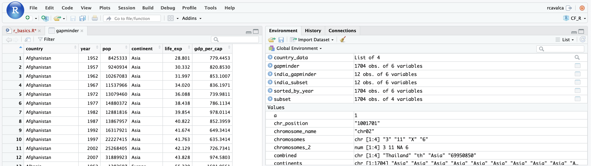

<style type="text/css">

body, td {
   font-size: 18px;
}
code.r{
  font-size: 12px;
}
pre {
  font-size: 12px
}

</style>

```{r chunk_options, include = FALSE}
source("../bin/chunk-options.R")
knitr_fig_path("03-")
```

# Objectives

In this lesson we will introduce two more data types: factors and data frames. Factors are the data type R uses to store categorical data. Data frames are probably the most commonly used data type in R, and is most similar to Excel spreadsheets. We will learn how to import data into R as a data frame, and in subsequent lessons how to manipulate, modify, summarize, and plot data contained in data frames.

# Factors

Factors are how R stores categorical information, like the continents, among our examples. It is like a character vector that can only have a finite number of values. To make a factor, we can pass an atomic vector into the `factor()` function. In the background, R recodes the data as integers and stores the results in an integer vector. It also adds a `levels` attribute to the integer vector enumerating the set of labels for displaying the factor values. The easiest way to see this is with an example:

```{r}
continents_factor = factor(continents)
continents_factor
typeof(continents_factor)
class(continents_factor)
as.integer(continents_factor)
```

We observe a few things with this string of commands:

1. It looks like the type of `continents_factor` is an integer vector.
2. But there is a class of vectors, called factors. R will often take into account the class of an object to decide how a function will act on it.
3. By default the `levels` of a factor are the unique elements of the character vector in alphabetical order.

You can specify an order by explicitly defining the levels as in:

```{r}
continents_factor = factor(continents, levels = c('South America', 'Asia', 'Africa', 'North America'))
continents_factor
as.integer(continents_factor)
```

Notice that the integer representation of the vector changed order, because the levels changed order. This will be useful later in the RNA-seq Demystified lessons when we discuss testing for differential expression and the assumptions DESeq2 makes about what factor level is the "reference".

> ## Tip: Treating objects as categories without changing their mode
>
> You don't have to make an object a factor to get the benefits of treating an object as a factor. See what happens when you use the `as.factor()` function on `continents`. To generate a tally, you can sometimes also use the `table()` function; though sometimes you may need to combine both (i.e. `table(as.factor(continents))`)

# Data Frames

Data frames group vectors together into a two-dimensional table, where each vector becomes a column of the table. The data types within each column must be the same (they are vectors after all), **but the columns can be of different data types**. Let's construct our first data frame using some vectors we have laying around. Here we will include column names from the start:

```{r}
countries_df = data.frame(country = countries, continent = continents, population = populations)
countries_df
dim(countries_df)
```

Since data frames are two-dimensional, we have to specify both the row and column to extract specific entries, as in:

```{r}
# Return the element in the second row, third column
countries_df[2, 3]
```

Since the columns of the data frame are named, we can also use those instead:

```{r}
# Return the element in the Ghana row of the population column
countries_df[2, 'population']
```

To access an entire row or column, we specify just the row or column index, as with:

```{r}
# Access the third row by index
countries_df[3, ]
```

And it is the same with columns:

```{r}
# Access the second column by index
countries_df[, 2]
# By name
countries_df[, 'continent']
```

Finally, data frames have another way to access columns using "dollar-sign notation":

```{r}
countries_df$continent
```

# Working with spreadsheets

A substantial amount of data is tabular, that is data arranged in rows and columns - also known as spreadsheets. We could write a whole lesson on how to work with spreadsheets effectively ([actually, Data Carpentry has](https://datacarpentry.org/organization-genomics/)). For our purposes, we want to remind you of a few principles before we work with our first set of example data:

**1. Keep raw data separate from analyzed data**

This is principle number one because if you can't tell which files are the original raw data, you risk making some serious mistakes (e.g. drawing conclusion from data which have been manipulated in some unknown way).

**2. Keep spreadsheet data Tidy**

The simplest principle of **Tidy data** is that we have one row in our spreadsheet for each observation or sample, and one column for every variable that we measure or report on. As simple as this sounds, it's very easily violated. Most data scientists agree that significant amounts of their time is spent tidying data for analysis. Read more about data organization in [this lesson](https://datacarpentry.org/organization-genomics/) and in [this paper](https://www.jstatsoft.org/article/view/v059i10).

**3. Trust but verify**

Finally, you don't need to be paranoid about data, but you should have a plan for how you will prepare it for analysis. You probably already have a lot of intuition, expectations, assumptions about your data - the range of values you expect, how many values should have been recorded, etc. Of course, as the data get larger our human ability to keep track will start to fail (it can fail for small data sets too). R can help you to examine your data so that you can have greater confidence in your analysis, and its reproducibility.

## Importing tabular data into R

There are several ways to import data into R. For our purpose here, we will focus on using the tools every R installation comes with (so called "base" R) to import a comma-delimited file containing the results of our variant calling workflow. We will need to load the sheet using a function called `read.csv()`.

> ## Exercise: Review the arguments of the `read.csv()` function
>
> **Before using the `read.csv()` function, use R's help feature to answer the following questions**.
>
> *Hint*: Entering '?' before the function name and then running that line will bring up the help documentation. Also, when reading this particular help be careful to pay attention to the 'read.csv' expression under the 'Usage' heading. Other answers will be in the 'Arguments' heading.
>
> 1. What is the default parameter for 'header' in the `read.csv()` function?
> 2. What argument would you have to change to read a file that was delimited by semicolons (;) rather than commas?
> 3. What argument would you have to change to read file in which numbers used commas for decimal separation (i.e. 1,00)?
> 4. What argument would you have to change to read in only the first 10,000 rows of a very large file?

<details>
<summary>Solution</summary>

1. The `read.csv()` function has the argument 'header' set to TRUE by default, this means the function always assumes the first row is header information, (i.e. column names)
2. The `read.csv()` function has the argument 'sep' set to ",". This means the function assumes commas are used as delimiters, as you would expect. Changing this parameter (e.g. `sep=";"`) would now interpret semicolons as delimiters.
3. Although it is not listed in the `read.csv()` usage, `read.csv()` is a "version" of the function `read.table()` and accepts all its arguments. If you set `dec=","` you could change the decimal operator. We'd probably assume the delimiter is some other character.
4. You can set `nrow` to a numeric value (e.g. `nrow=10000`) to choose how many rows of a file you read in. This may be useful for very large files where not all the data is needed to test some data cleaning steps you are applying.

Hopefully, this exercise gets you thinking about using the provided help documentation in R. There are many arguments that exist, but which we wont have time to cover. Look here to get familiar with functions you use frequently, you may be surprised at what you find they can do.
</details>
<br>

Now, let's read in the file `data/gapminder_data.csv` and call this data `gapminder`. The first argument to pass to our `read.csv()` function is the file path for our data. The file path must be in quotes and now is a good time to remember to use tab autocompletion. **If you use tab autocompletion you avoid typos and errors in file paths.** Use it!

```{r display_read, eval = FALSE, purl = FALSE}
## read in a CSV file and save it as 'gapminder'
gapminder <- read.csv("data/gapminder_data.csv")
```


```{r real_read, echo = FALSE, eval = TRUE, purl = FALSE}
## silently read in CSV file from data/ folder, but relative to where this is knits
gapminder <- read.csv("../data/gapminder_data.csv")
```

One of the first things you should notice is that in the Environment window, you have the `gapminder` object, listed as 1704 obs. (observations/rows) of 6 variables (columns). Double-clicking on the name of the object will open a view of the data in a new tab.



> ## Tip: Changes in R don't overwrite the original file
>
> When you work with data in R, you are not changing the original file you loaded that data from. This is different than (for example) working with a spreadsheet program where changing the value of the cell leaves you one "save"-click away from overwriting the original file. You have to purposely use a writing function (e.g. `write.csv()`) to save data loaded into R. In that case, be sure to save the manipulated data into a new file. More on this later in the lesson.

## Summarizing, subsetting, and reordering a data frame

A **data frame is the standard way in R to store tabular data**. A data frame is a collection of vectors of the same length. Let's use the `str()` (structure) function to look a little more closely at how data frames work:

```{r, purl = FALSE}
## get the structure of a data frame
str(gapminder)
```

Some things to notice:

- the object type `data.frame` is displayed in the first row along with its dimensions, in this case 1704 observations (rows) and 6 variables (columns)
- Each variable (column) has a name (e.g. `country`). This is followed by the object mode (e.g. chr, int, etc.). Notice that before each variable name there is a `$` - which is a hint as to how one can access these columns, as we saw when we first introduced data frames.

### Summarizing

We can get a birds eye view of a data frame by using the `summary()` function. Depending on the type of data in the columns, `summary()` will do particular things:

```{r, purl = FALSE}
## get summary statistics on a data frame
summary(gapminder)
```

Our data frame has 6 variables, so we get 6 fields that summarize the data. The `year`, `pop`, `lifeExp` and `gdpPercap` variables are numerical data and so you get summary statistics on the min and max values for these columns, as well as mean, median, and interquartile ranges. The other variables, `country` and `continent`, are treated as characters data (more on this in a bit).

### Subsetting

We saw how to subset a data frame in the previous section, but in all those examples we printed values to the screen. You can create a new data frame object by assigning them to a new object name:

```{r, purl = FALSE}
# create a new data frame containing only observations from India
india_subset <- gapminder[gapminder$country == 'India',]
india_subset

# check the dimension of the data frame
dim(india_subset)

# get a summary of the data frame
summary(india_subset)
```

### Reordering

With vectors we saw the `sort()` function returned the reordered vector, and that the `order()` function returned the indices giving the order of the reordered vector. Let's use the `order()` function to change the ordering of `india_subset` so that the most recent years are at the top of the table.

First look at the help for `?sort` and `?order` and note the `decreasing` parameter. If we want the years to be decreasing, we should set this parameter to `TRUE`.

```{r, purl = FALSE}
sort(india_subset$year, decreasing = TRUE)
```

This is the right ordering we want, but but we want the indices so that we can reorder the rows of `india_subset`. Using `order()` to give the row indices in the correct order gets us where we want to go:

```{r, purl = FALSE}
india_subset_decreasing = india_subset[order(india_subset$year, decreasing = TRUE), ]
india_subset_decreasing
```

## Coercing data

When we looked at `summary(gapminder)` and `str(gapminder)`, we noticed the type for continent was `character`, but perhaps a `factor` is more appropriate here because there are only a small number of possible values. We can "coerce" the `continent` column of `gapminder` to be a factor using the `factor()` function.

```{r}
# Coerce the continent column to a factor
gapminder$continent <- factor(gapminder$continent)
```

And let's see how the result of `summary()` and `str()` change in response:

```{r}
summary(gapminder)
str(gapminder)
```

Notice that we got some additionally useful information from `summary()` from the coercion. Namely, we get the number of entries in `gapminder` that are on each continent.

> ## Note: StringsAsFactors
>
> There are explicit forms of coercion, as in our factor example above. But there are also implicit coercions. The most famous example of this in R is the `stringsAsFactors` parameter of `read.table()`. Prior to R 4.0, when importing a data frame the `stringsAsFactors` argument was `TRUE` by default, which caused all character columns to be factors by **default**. This wasn't a good default behavior, and the default is now `FALSE`.

## Saving your data frame to a file

We can save data to a file. We will save our `india_subset` object to a .csv file using the `write.csv()` function:

```{r, eval = FALSE, purl = FALSE}
write.csv(india_subset, file = "results/india_subset.csv")
```

The `write.csv()` function has some additional arguments listed in the help, but at a minimum you need to tell it what data frame to write to file, and give a path to a file name in quotes (if you only provide a file name, the file will be written in the current working directory).

# Data tips

At the beginning of the lesson we suggested three things when dealing with data in R:

1. Keep raw data separate from analyzed data
2. Keep spreadsheet data Tidy
3. Trust but verify

As we all know, data can be messy--errors can be made when entering it--and at some point those errors need to be corrected. To elaborate on "Trust but verify," consider the fact that in the `gapminder` data set we had many countries over many continents, and any misspelling could cause problems when summarizing the data. For instance, "North America" could accidentally be entered as "NorthAmerica" or "North america". When reading in data, it's a good idea to check that there aren't any odd things happening like this.

For character / categorical data, simply looking at the unique elements of a column can help detect errors quickly:

```{r}
unique(gapminder$continent)
```

In this case, we don't see any obvious misspellings that could cause problems. For numeric data, looking at a summary of the column to see the min/max values, as well as the mean/median, can help determine if any obvious errors are present.

```{r}
summary(gapminder$pop)
```

In this case, we don't notice any values that might be out of the ordinary. For example, we know that there are countries with over a billion people, so seeing a maximum of 1,319,000,000 is not strange. At the same time, we know there are very small countries, so seeing a minimum of 60,000 seems reasonable too. What would be unreasonable would be a negative population, for example.
